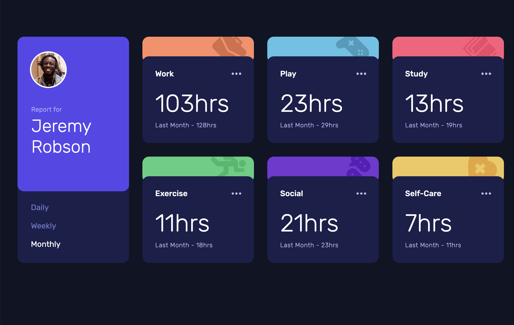

# Frontend Mentor - Time tracking dashboard solution

This is a solution to the [Time tracking dashboard challenge on Frontend Mentor](https://www.frontendmentor.io/challenges/time-tracking-dashboard-UIQ7167Jw). Frontend Mentor challenges help you improve your coding skills by building realistic projects.

## Table of contents

- [The challenge](#the-challenge)
- [Screenshot](#screenshot)
- [Links](#links)
- [Built with](#built-with)
- [What I learned](#what-i-learned)

## Overview

### The challenge

Users should be able to:

- View the optimal layout for the site depending on their device's screen size

### Screenshot

### Links

- Solution URL: [https://github.com/tunaerten/card-component]
- Live Site URL: [https://card-component-erten.netlify.app]

## My process

### Built with

- Semantic HTML5 markup
- CSS custom properties
- Flexbox
- CSS Grid
- Mobile-first workflow
- JavaScript

### What I learned

I didn't have much trouble with the CSS part. I got stuck a bit on the colored part of the cards. Initially, I did it using a pseudo-element, but then I changed it later. This part took some time. In the JS part, rendering the view also took a while. In my first code, I could see the view when I clicked on the daily or weekly section, but when I loaded the page, the activities didn't show up. However, I realized I only needed a single function I hadn't noticed. I think I won't get stuck on this part for so long in my future projects.It was quite a fun project.
